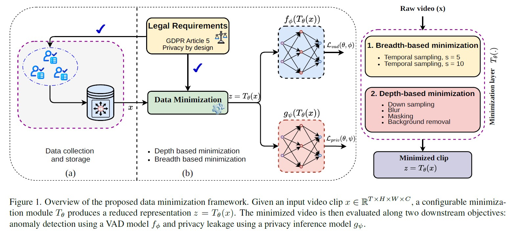
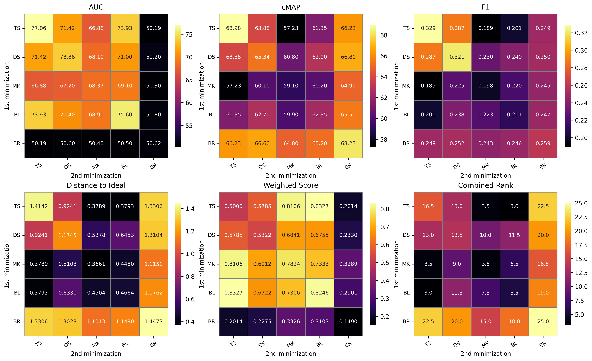
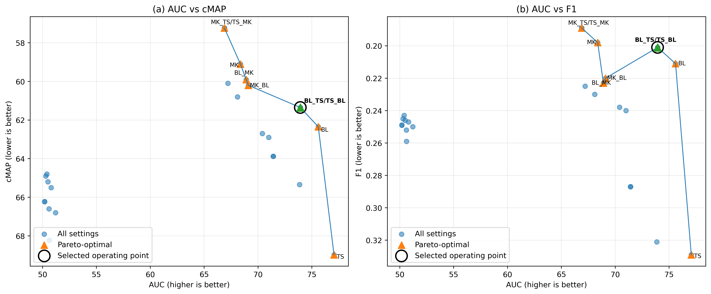

# Only What’s Necessary: Pareto-Optimal Data Minimization for Privacy Preserving Video Anomaly Detection

---

<p align="center">
  <a href="https://github.com/Rabusi/only-what-s-necessary/stargazers">
    
  </a>
  <a href="https://github.com/Rabusi/only-what-s-necessary/network/members">
    
  </a>
  <a href="https://arxiv.org/abs/2504.14301">
    
  </a>
</p>

---


⭐ If you find this work helpful to your research, Don't forget to give a star to this repo. Thanks! 🤗

**"Only What’s Necessary: Pareto-Optimal Data Minimization for Privacy Preserving Video Anomaly Detection."**

## 📄 Abstract

Video anomaly detection (VAD) systems are increasingly
deployed in safety-critical environments and require a large
amount of data for accurate detection. However, such data
may contain personally identifiable information (PII), in-
cluding facial cues and sensitive demographic attributes,
creating compliance challenges under the EU General Data
Protection Regulation (GDPR). In particular, GDPR re-
quires that personal data be limited to what is strictly nec-
essary for a specified processing purpose. To address this,
we introduce Only What’s Necessary, a privacy-by-design
framework for VAD that explicitly controls the amount and
type of visual information exposed to the detection pipeline.
The framework combines breadth-based and depth-based
data minimization mechanisms to suppress PII while pre-
serving cues relevant to anomaly detection. We evaluate a
range of minimization configurations by feeding the mini-
mized videos to both a VAD model and a privacy inference
model. We employ two ranking-based methods, along with
Pareto analysis, to characterize the resulting trade-off be-
tween privacy and utility. From the non-dominated fron-
tier, we identify sweet spot operating points that minimize
personal data exposure with limited degradation in detec-
tion performance. Extensive experiments on publicly avail-
able datasets demonstrate the effectiveness of the proposed
framework.

## 🏗️ Project Structure

```text
📦 Only whats necessary/
├── 📁 library/                  
├── 📁 models/
├── 📄 Config.py
├── 📄 Evaluation.py
├── 📄 train.py
├── 📄 train_privacy.py                 
├── 📄 readme

```                       


## 🧩 Proposed Framework



## 📊 Results




## 📬 Contact

For any inquiries or feedback, feel free to reach out: [naas@create.aau.dk](mailto:naas@create.aau.dk)
